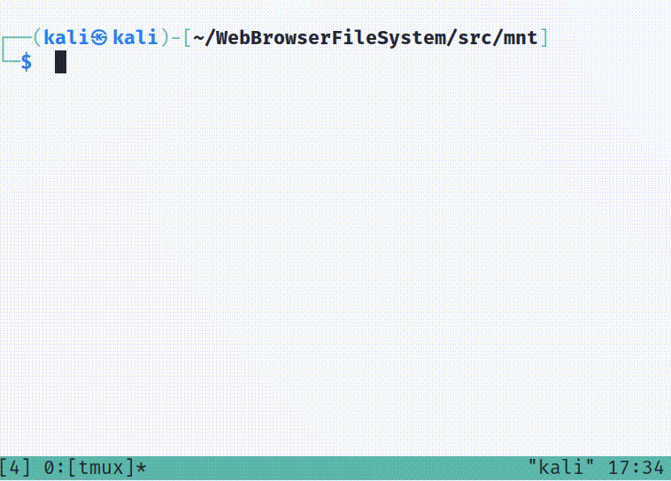

# WebBrowserFileSystem
Can your file system be treated as a web browser? This WebBrowserFileSystem repository enables using UNIX's core utilities such as `cat`, `ls`, and `vi` to make network requests to download content from the Internet.

One challenge of working with Linux's command line tools is that their interface for network data differs greatly from that of viewing local files. For local files, one typically uses commands such as `cat`, `ls`, and `less` to browse the file. For Internet content, there exist separate commands `wget` or `curl` to download it. And for s3 data, Amazon recommends using its SDK. Instead of a user memorizing multiple command line interfaces, WebBrowserFileSystem unifies them all: users can now `cat example.com` or `grep s3://<bucket>/<file>`. WebBrowserFileSystem utilizes [FUSE](https://github.com/libfuse/libfuse) to intercept Linux system calls to make network requests for supported protocols. This provides a seamless experience for users who no longer need to concern themselves with the location of the data they are viewing.

## What does it look like?
From the mounted directory, run your favorite Linux commands such as `ls`, `less`, and `grep` to access remote content:


## Supported protocols
* HTTP/HTTPS
* FTP
* Amazon S3 buckets (public-only)
* [DICT](https://en.wikipedia.org/wiki/DICT)

## Installation
```bash
# first, install meson & ninja to build fuse
$ sudo apt install meson
$ sudo apt install ninja-build

# next, install fuse, directions here:
https://github.com/libfuse/libfuse
# download fuse tar first, then:
$ tar -xf <tar>.xz

# install fuse development tools
$ sudo apt install libfuse-dev

# install sqlite
$ sudo apt install libsqlite3-dev 

# install curl
$ sudo apt install libcurl4-openssl-dev

## WebBrowserFileSystem steps ##
# Clone this repository
$ git clone https://github.com/tnear/WebBrowserFileSystem.git

# Lastly, build source
$ cd src
$ make

# (optional) Build and run tests
$ cd test
$ make
$ ./test

```
## Setup
```bash
$ cd src
# create mount directory (if doesn't already exist)
$ mkdir -p mnt
# start WebBrowserFileSystem executable using 'mnt' as the special directory
#    -f = run in foreground, required for print statements
#    -s = single-threaded, aids debugging
$ ./WebBrowserFileSystem -s -f mnt/

# Lastly, open a new terminal/screen then change to your mounted directory
$ cd src/mnt
# WebBrowserFileSystem is now ready to accept network commands! (see section below)
```

## Using WebBrowserFileSystem to download files
WebBrowserFileSystem allows using core unix utilities to make network requests and downloading content. Supported commands include `cat`, `vi`, `head`, `less`, `grep` and many `more`! 

Ensure that:
- WebBrowserFileSystem is running in a separate terminal
- Your present working directory is the mounted directory (`mnt` in the example above)

Examples:
```bash
# HTTP/HTTPS using 'head':
$ head -n1 example.com                              
<!doctype html>

# Search s3 bucket (the slash character must be replaced with backslash) using 'grep':
$ grep 'hello' s3:\\\\my-bucket\\index.html
<html><body><h1>hello, world</h1></body><html>

# FTP using 'vi':
$ vi ftp:\\\\ftp.slackware.com\\welcome.msg
```
- Note 1: all the commands above (`head`, `grep`, `vi`) can be used with any supported network protocol.
- Note 2: the `'/'` character is not permitted in UNIX file names. Instead, use backslash (`'\'`) which must be escaped as `'\\'`.

## Future enhancements
- Writing data. Everything now is read-only.
- Private Amazon AWS S3 buckets.
- mmap and swapon. These would likely require updates to FUSE's source code.
- Distributed file systems. WebBrowserFileSystem is limited to one user and one machine.
